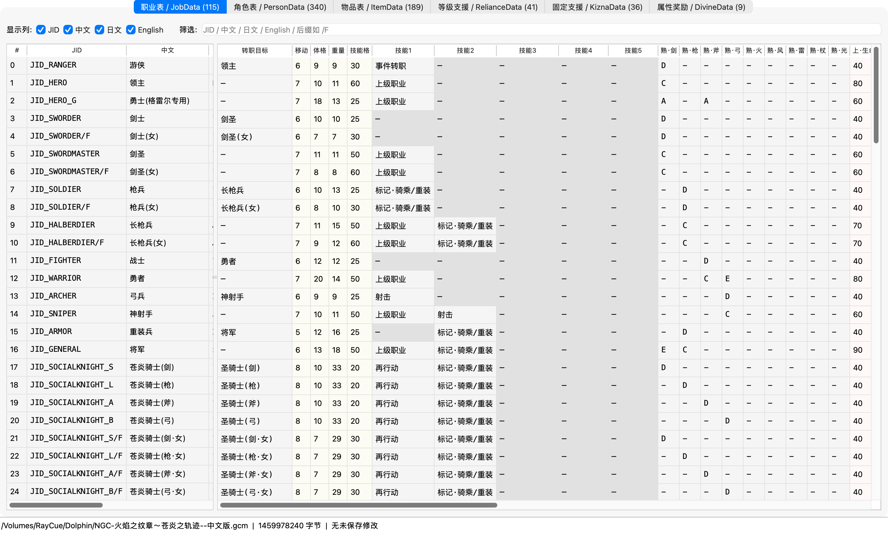
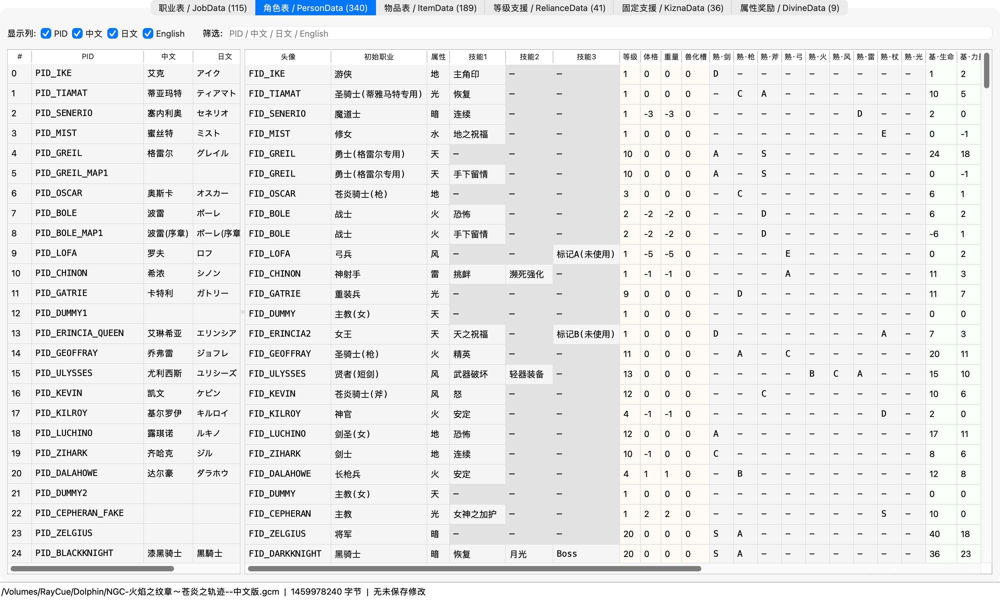
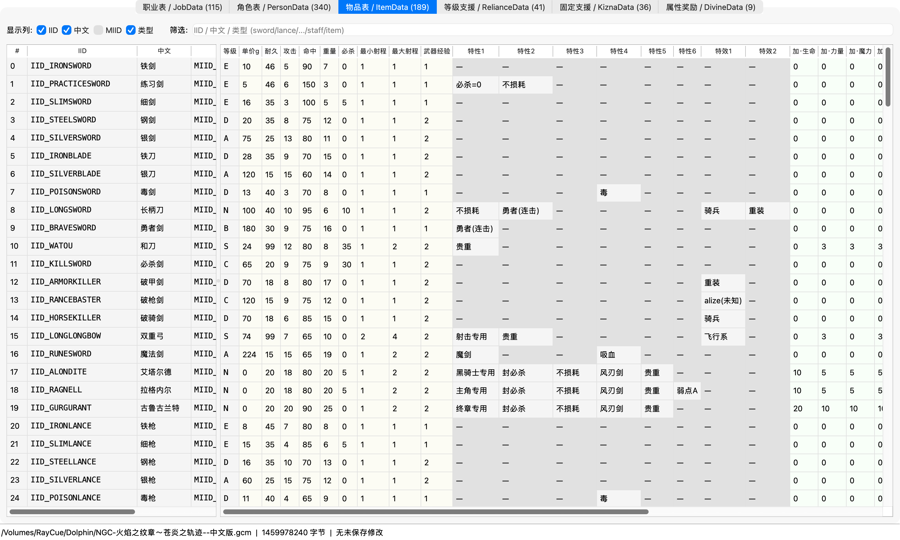
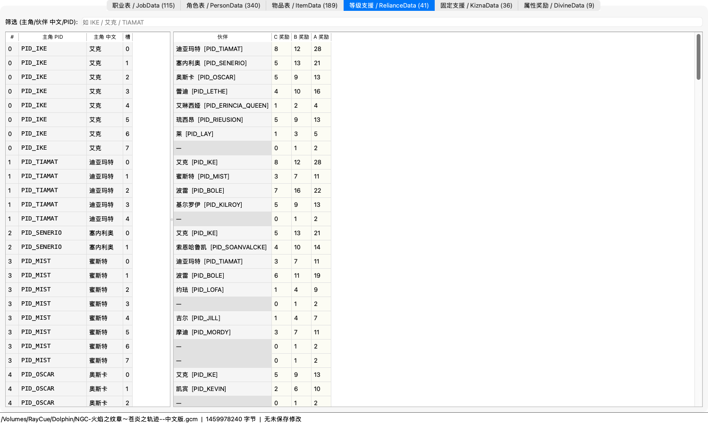
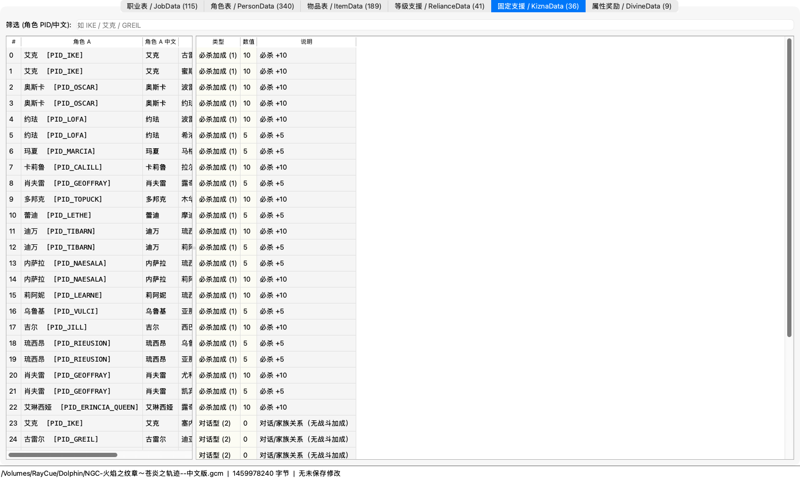
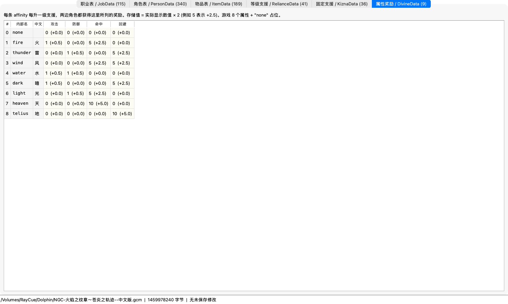

# FE9 编辑器 (FE9 Editor)

针对 GameCube 游戏《火焰之纹章 苍炎之轨迹》(Fire Emblem: Path of Radiance, GFEJ01) 的 ROM 数据可视化编辑工具。基于 PyQt6 构建，直接读写 GCM 文件中的 `FE8Data.bin`，**不改变文件大小**，可在 Dolphin 模拟器或真机上加载使用。

中文 / 日文 / English 三语职业、人物、物品名称对照，技能 / 物品特性下拉选择，所有改动 Save 前预览 + 备份哈希校验。



## 功能

| 数据表 | 数量 | 可编辑字段 |
|---|---|---|
| **职业表 / JobData** | 115 | 转职目标、移动、体格、重量、技能格、5 个技能（中文下拉）、武器熟练度 9 项（剑/枪/斧/弓/火/风/雷/杖/光）、上限/基础/成长/兽化各 8 项 |
| **角色表 / PersonData** | 340 | 等级、体格、重量、兽化槽、3 个技能（中文下拉）、基础值（含负偏移）、成长率 + 只读：头像 / 初始职业 / 属性 / 武器熟练度 |
| **物品表 / ItemData** | 189 | 单价 / 耐久 / 攻击 / 命中 / 重量 / 必杀 / 射程 / 武器经验 / 6 个特性下拉 / 2 个特效下拉 / 8 项加成 / 8 项成长 |
| **等级支援 / RelianceData** | 41 | 主角 + 伙伴 PID（下拉）+ C/B/A 阈值字节 |
| **固定支援 / KiznaData** | 36 | 角色 A/B PID（下拉）+ 类型（必杀加成/对话型）+ 数值 |
| **属性奖励 / DivineData** | 9 | 8 属性 + none，每属性 4 字节（攻/防/命中/回避），存储值 ×0.5 = 实际显示 |

### 截图

<details>
<summary>角色表 / PersonData</summary>


</details>

<details>
<summary>物品表 / ItemData</summary>


</details>

<details>
<summary>等级支援 / 固定支援 / 属性奖励</summary>




</details>

附带：
- 可拖动分隔条 + 列宽调整 + 显示语言列勾选（JID/中文/日文/English 任意组合）
- 修改实时高亮（黄色 = 未保存）
- File > Save 弹 diff 预览，列出全部 before → after，确认后才写盘
- 写盘前自动比对 `.gcm.bak` hash，发现不一致弹警告
- Tools > Apply caps_config 规则，对全部 promoted class 应用预设规则（caps_config.py 是示例，可改）

## 已知限制

- **指针字段重定位限制**：FE8Data.bin 内部的指针重定位表只登记原本非 null 的字段。**不能给原本为空的技能/特性槽添加新指针**，会让游戏崩。编辑器自动检测：原本为空的槽位以**浅灰锁定底色**显示，不可编辑。
- **武器熟练度块共享**：多个职业/角色可能指向同一熟练度块，修改任一会同时影响所有共享方。首次编辑会弹警告并列出所有共享条目。
- 部分内部字符串无文档：`alize`(物品特效)、`telius`(角色属性)、`SID_EQ_A/B/C/D` 等的确切意义靠数据观察推断，可能不准确。
- 不支持存档(.gci) 编辑 — FE9 存档格式无公开文档。要给单个角色加技能可用 Action Replay / Gecko 代码（参见 [gamehacking.org](https://gamehacking.org/?game=54777)）。

## 下载

预编译 macOS .app 见 [Releases](https://github.com/zonzideka/fe9-editor/releases)。下载 `.zip` 解压后双击启动。如果系统提示"未签名"，右键 → 打开。

## 安装运行

需要 Python 3.10+ 和 PyQt6。

```bash
git clone https://github.com/zonzideka/fe9-editor.git
cd fe9-editor
python3 -m venv .venv
.venv/bin/pip install -r requirements.txt
.venv/bin/python fe9_editor.py
```

启动后 File > Open GCM 选择你的 FE9 GCM 文件。

## 打包独立 .app / .exe

需先 `pip install pyinstaller`：

```bash
.venv/bin/pyinstaller --windowed --name "FE9 编辑器" --add-data "translations.json:." --noconfirm fe9_editor.py
```

输出在 `dist/FE9 编辑器.app`(macOS) 或 `dist/FE9 编辑器/`(Windows/Linux)，约 70MB（含 Python runtime + Qt 库）。

## 命令行工具

仓库还含几个 CLI 脚本，可在不开 GUI 的情况下使用：

```bash
# 解析 GCM/FST、列出文件、提取 system.cmp
fe9_tool.py info <gcm>
fe9_tool.py extract <gcm> system.cmp

# Dump 所有职业的当前 caps
fe9_dump_classes.py <gcm>

# 按 caps_config.py 规则批量改 caps（先 dry-run）
fe9_patch_caps.py <gcm>
fe9_patch_caps.py <gcm> --apply
```

## 翻译数据

`translations.json` 包含：
- `jobs` (109): JID → 中文/日文/英文
- `persons` (82): PID → 中文/日文/英文
- `affinities` (8): 属性英文 → 中文
- `skills` (97): SID → 中文
- `items` (200): IID → 中文
- `item_traits` (34): 物品特性 → 中文
- `item_effects` (7): 物品特效 → 中文

可直接编辑 JSON 文件覆盖任何译名。重启 app 立即生效。

## 姊妹项目

- [**fe9-modifier-macos**](https://github.com/zonzideka/fe9-modifier-macos) — Dolphin **运行时内存**动态修改器 macOS 移植版（人物 / 能力 / 技能 / 装备 / 支援 / 金钱实时改）

| 工具 | 用途 | 改动持久性 |
|---|---|---|
| **fe9-editor**（本仓库） | ROM 文件编辑（GCM 内 FE8Data.bin） | 永久；所有新存档都生效 |
| **fe9-modifier-macos** | 实时改 Dolphin 进程内存 | 仅当前游戏会话；ROM/存档不变 |

## 致谢

- [Universal-FE-Randomizer](https://github.com/lushen124/Universal-FE-Randomizer) - FE8Data.bin 各表 byte-level layout 的关键参考
- [Serenes Forest](https://serenesforest.net/path-of-radiance/) - FE9 数据百科
- [天馬騎士団](https://www.pegasusknight.com/mb/fe9/) / [イラレブック](https://eikyuhozon.com/) / [Fire Emblem Wiki](https://fireemblemwiki.org/) - 技能/物品名考据
- [百度百科 苍炎之轨迹](https://baike.baidu.com/item/%E7%81%AB%E7%84%B0%E4%B9%8B%E7%BA%B9%E7%AB%A0%EF%BC%9A%E8%8B%8D%E7%82%8E%E4%B9%8B%E8%BD%A8%E8%BF%B9/6754496) - 中文译名

## License

MIT — 见 [LICENSE](LICENSE)。
